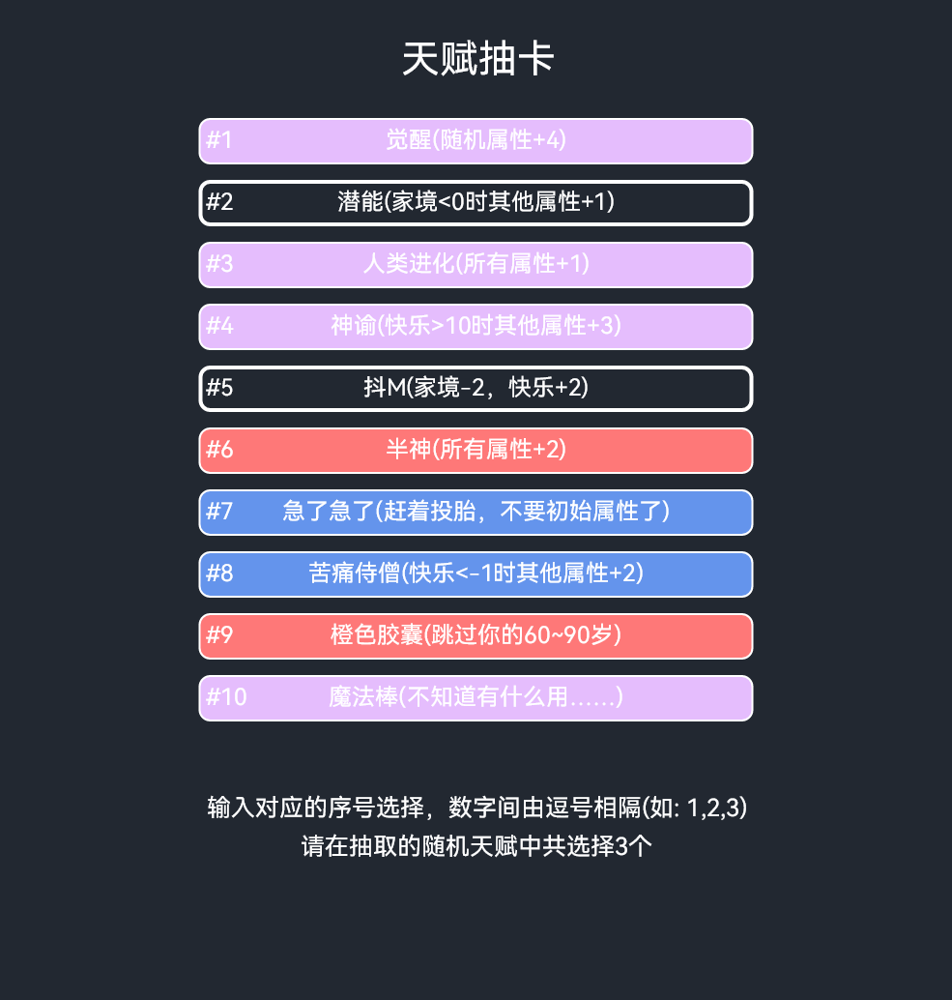
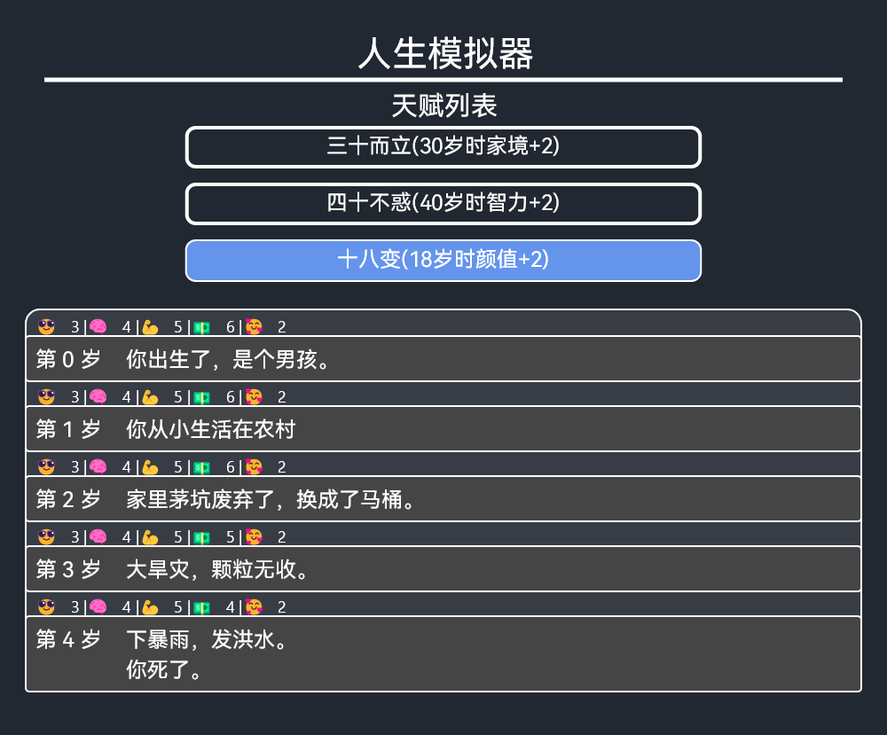

# life-restart-bot

---

## 人生重开模拟器

一个基于 [mirai](https://github.com/mamoe/mirai) 的人生重开模拟器

### 如何使用？

- 下载 [release](https://github.com/HatoYuze/life-restart-bot/releases/latest) 中的 `life-restart-bot-xxx-mirai2.jar`
- 随后丢进你的 [mcl](https://github.com/iTXTech/mirai-console-loader) 的 `plugins` 中
- ~即可成功安装插件~

在授予权限后，发送指令 `/remake start` 开始人生模拟器

您可以添加参数来设定初始属性，它们按照以下规律:
> `/remake start (初始颜值值) (初始智力值) (初始体质值) (初始家境值) (初始快乐值)`
> 
> 默认下, 会随机分配
> 分配的值总和不可以超过配置文件 `game.yml` 中 `maxAttributePoint` 的值，否则将会按比例重新分配

> 您可能需要 [project-mirai/chat-command](https://github.com/project-mirai/chat-command) 插件

首先，`bot`会发送随机抽取的天赋列表,如：

共有 `10` 个天赋，
使用者需要发送**用逗号分割**的序号列表

如:`1,2,3` 或 `1，2，3` **(但 `1，2,3`这类混合使用中英文逗号的是无效的)**

随后，bot会按照所提供的序号选择天赋，并发送人生模拟器结果

> 如果您不想获取图片结果，可以使用 `/remake text` 代替 `/remake start`

### 配置文件

在加载完插件后， `life-restart-bot` 会读取位于 `config/com.github.hatoyuze.restarter.life-restarter` 下的配置文件，我们推荐您对其相关内容进行修改

|                    名称                     |   作用    |
|:-----------------------------------------:|:-------:|
| [register](./docs/config-register-doc.md) |  自定义事件  |
|     [game](./docs/config-game-doc.md)     | 插件的相关设定 |

### 指令
以下所有指令都需要前缀 `/remake` 才能触发调用，且需要授予权限

| 子指令名 及 参数                   |                                                               说明                                                                |          版本          |
|:----------------------------|:-------------------------------------------------------------------------------------------------------------------------------:|:--------------------:|
| `start (颜值) (智力) (体质) (家境)` |                                                开始一场新的人生，后面的参数为初始点数分配, 默认值都为 `0`                                                 |       `0.1.0`        |
| `text (颜值) (智力) (体质) (家境)`  |                                                  同上，但是返回文字（聊天记录）的结果，默认值都为 `0`                                                   | `0.4.0` (原为 `start`) |
| `my`                        |                                                   获取自己的重生历史记录 按照评分**排序的前十位**                                                    |       `0.5.0`        |
| `rank (范围)`                 | 获取排行榜  范围可填入参数 `hour` `day` `week` `month` `all`, 以及其各项首字母(**默认为 `day`**)  _它们分别表示： 一小时内，一天内，一周内，一个月 _(取 30 天)_ 内，所有可用记录_ |       `0.5.0`        |
| `recall [id]`               |                                               回忆**在存储中**的人生模拟结果   `id` 为其存档的序号                                               |       `0.5.0`        | 
| `event [id]`                |                                                      获取指定事件的详情信息 (可在控制台触发)                                                      |       `0.3.0`        |
| `talent [id]`               |                                                       查询天赋的详细信息 (可在控制台触发)                                                       |       `0.3.0`        |

> 注：参数中的 括号`()`表示**选填项**，存在默认值 
> 而 `[]` 表示**必填项**，必须提供符合要求的值
> 
> 关于点数的分配可见 [config-register-doc](./docs/config-register-doc.md) 中的描述
> 
> > 注: 在 0.5.2 版本点数分配按照 [原项目](https://github.com/VickScarlet/lifeRestart) 重构，将`快乐`点数的大小默认下设定为 `5`，**不消耗点数量**。   对于 `0.5.2` 之前的版本则可能需要**消耗点数量**以 提供`快乐`的点数

### 权限

若想要插件正常运行，你需要给予用户 `com.github.hatoyuze.restarter.life-restarter:command-execute` 权限

你可以使用以下指令，使所有用户**都可以**正常使用相关指令
> perm add u* com.github.hatoyuze.restarter.life-restarter:command-execute

如果你希望只有指定的用户可以使用，将`u*`改为`u对应qq号`即可，例如：
> perm add u114514 com.github.hatoyuze.restarter.life-restarter:command-execute

如果没有该权限，**任何**有关本插件的指令**都无法**正常调用哦！

### 特别鸣谢

- [VickScarlet/lifeRestart](https://github.com/VickScarlet/lifeRestart)
- [Scabiosa/lifeRestart](https://github.com/Scabiosa/lifeRestart)
