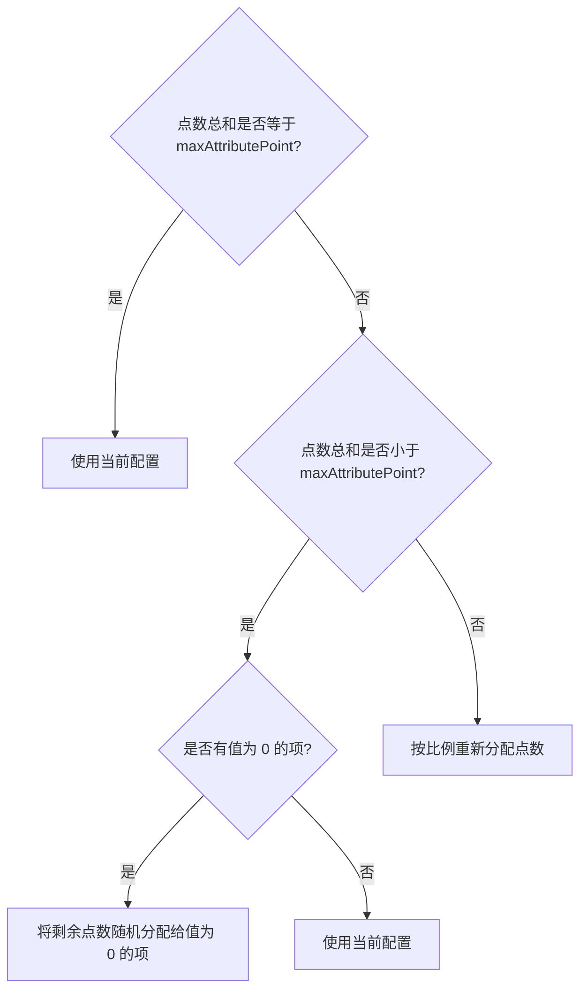

# 插件设置

> 用于对插件的 频率 等内容作出设定，它一般被存放在 `/mcl/config/com.github.hatoyuze.restarter.life-restarter/game.yml` 目录下

这些配置**仅会**在插件**启动**时读取，您**无法**在运行中修改

更改配置时，请先退出当前运行的 `mcl` 程序后再修改

默认配置:
```yaml
# 最大总属性点，用户分配的属性点最终一定为该值（默认为20）
maxAttributePoint: 20
# 在内存中缓存运行过程中创建的临时事件
enableCacheTemporaryEvent: false
# 缓存每一次游戏的结果，为 false 时不再缓存，且无法使用排行榜等功能
enableGameSave: true
# 缓存数据的过期时间，过期后这些数据将会被永久删除，单位为小时。为 -1 时永远不会删除。
# 需要启用 enableGameSave 功能
dataExpireTime: -1
# 绘图使用的字体，如需自定义需要在此处填写字体文件的绝对路径
# 默认下使用 HarmonyOS Sans Regular 字体
defaultFont: ''
# 临时存储文件的目录
# 在插件退出时，这些图片会被清除, 为空时表示插件的 data 目录
cachePath: ''
# 关于人生模拟器的相关频率限制
limit: 
  # 每个用户一天内（UTC+8 00:00 时刷新）的模拟人生最高次数。为 -1 时无限制
  userDailyGamingLimit: -1
  # 冷却的作用单位，可选为 GROUP 或者 SENDER
  # - 选用 SUBJECT 表示冷却为整个 联系人 对象(可能为群聊 或者 好友)
  # - 选用 SENDER 表示冷却指令发送者频率
  frequencyType: SUBJECT
  # 执行指令冷却的时长，单位为秒
  #   为 -1 时表示无冷却
  frequencyLimitSeconds: -1
```


## maxAttributePoint
> 初始最大点数 需要为一个大于 `10` 的**正整数**，**默认为 `20`**

这项配置在使用指令 `/remake start (初始颜值) (初始智力) (初始体质) (初始家境) (初始快乐)` 或 `/remake text (初始颜值) (初始智力) (初始体质) (初始家境) (初始快乐)` 中起效

> 带有括号 `()` 表示为可选参数，默认值为 0

当执行指令时，插件会将**参数中**分配的值**重新分配**

具体来说，无非就是以下逻辑



**但是如果总和小于`10`，无论如何都会重新随机分配，因为大多时候它的误差较大**

举个例子 **（`maxAttributePoint` 设定为 `20`）**
- 输入 `1,2,3,4,5` 会得到 `1, 2, 3, 4, 5`
- 输入 `20,35,30,10,5` 会得到 `4, 7, 6, 2, 1`
- 输入 `0,2,0,4,5` 可能会得到 `8, 2, 1, 4, 5`

一些天赋会增加可用点数 (_初始可用属性点_), 这些点数在分配时会与`maxAttributePoint`**相加**后作为最终结果

## enableCacheTemporaryEvent
> 在内存中缓存运行过程中创建的临时事件，**默认为 `false`**

一般人可以忽略，毕竟它对性能的影响真的可以说是微乎其微

不过如果您存在大量**随机的属性变化**事件，为了提高运行速度也可以将此项设置为 `true`

> `临时事件` 是指 不在配置文件中出现 而 在**运行时注册** 的事件，通常被用于某种事件的转义，
> `id`始终为负数，仅会在以下情况中出现：
> - **触发天赋** 触发天赋时，生成一个 
>   `id` 为 _天赋 `id` 减去 `10000`_ 内容为 `天赋【xxx】发动: 描述...` 的事件
> - **随机属性变化** 当事件 `effect` 中存在 `RDM` 时，会进行事件的**转义**，
>   将`RDM`转换为**真实触发**的类型，`id`为`原id的相反数 * 10 + 索引`

## enableGameSave
> 缓存每一次游戏的结果，为 false 时不再缓存，且无法使用排行榜等功能，默认为`true`

只要启动了人生模拟器就会将结果缓存下来，这些存档被保存在 `data/com.github.hatoyuze.restarter.life-restarter/life.yml` 中

这项功能涉及 排行榜, 个人历史记录, 人生回放 等指令的实现，如果为 `false` 则这些指令都无法正常使用

您可以通过**调整过期时间**来限定数据缓存的时间

## dataExpireTime
> 缓存数据的过期时间，过期后这些数据将会被**永久删除**，**单位为小时**。为 -1 时永远不会删除。**默认为 `-1`**
>
> 该项需要前项 `enableGameSave` 设定为 `true`

如果您希望仅存储**一定时间内**发生的事件，可以使用该项设定存储时长。

在实现中，判断是否过期并删除的操作**仅**会在`(UTC+8) 00:00`时进行。**如果程序并未运行，则可能无法自动清除过期的事件**

## defaultFont
> 绘图文字使用字体的绝对路径 为空时使用 `HarmonyOS Sans Regular` 字体
> **默认为空**

需要填写绝对路径，且目标路径为有效数据，如 `ttf` `otf` 等相关字体类型，**如果目标为字体集合文件，选用其中的第一位**

注：该项只涉及**文字**部分，绘图使用的 `emoji` 字体**是无法设定的**

## cachePath
> 临时存储文件的目录 为空时使用插件的 data 目录 **默认为空**

人生模拟器的图片结果会存放到该目录下，在**退出插件**时删除该目录下的**所有** `png` 文件

## limit
> 关于人生模拟器的相关频率限制

其配置内部有以下选项，仅对“重新开始模拟”这一操作进行限制

### userDailyGamingLimit
> 每个用户一天内（**UTC+8 00:00 时刷新**）的模拟人生最高次数。为 -1 时无限制 **默认为`-1`**

当超过最高**调用次数**后，该用户**在一天内**无法再次模拟**新的人生**，但是它仍可以使用 `/remake recall` 查看**模拟过的人生**

> 此处的 “一天” 并不指 24 小时，而是 北京时间 (UTC+8)的 0时

### frequencyType
> 冷却的作用单位，可选为 GROUP 或者 SENDER. **默认为 `SUBJECT`**

- 选用 `SUBJECT` 表示为**整个** **联系人** 对象(可能为群聊 或者 好友)
- 选用 `SENDER` 表示指令**发送者频率**

> #### 二者的区别？
>  - 如果使用了 `SUBJECT`： 假设有用户 A,B,C,D 都在**同一个群** g 内。
> 在触发冷却后，只是无法在**群聊 g 内**继续使用相关指令。但是他们**仍可以前往**别的机器人存在的*群聊* 或 _好友私信_ **继续使用指令**
>  - 如果使用 `SENDER`： 则是谁触发的就**只冷却**谁，若 A 触发了限制，则 A 无论是好友私信还是别的群聊 只要还在冷却中就**都无法继续游玩**，但**别的群友**可以**继续**使用指令

### frequencyLimitSeconds
> 执行指令冷却的时长，单位为秒 为 -1 时表示无冷却. **默认为 `-1`**

在触发冷却后，需要等待 `frequencyLimitSeconds` 秒后才可以继续使用


---
[返回](../README.md)