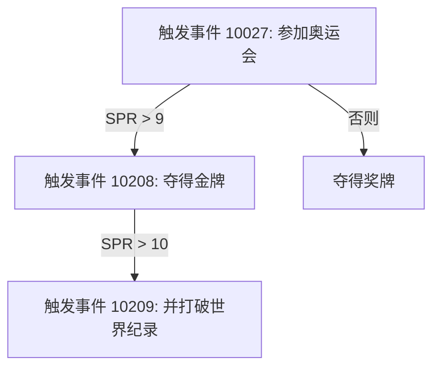

# 自定义事件

> 向人生重开器中添加自己编写的事件
>
> 关于内置的年龄事件/天赋/事件，可以查看 `github`
> 源上的 [ages.json](https://github.com/HatoYuze/life-restart-bot/blob/master/src/main/resources/data/ages.json)
> [talents.json](https://github.com/HatoYuze/life-restart-bot/blob/master/src/main/resources/data/talents.json)
> [events.json](https://github.com/HatoYuze/life-restart-bot/blob/master/src/main/resources/data/events.json)
>

`life-restart-bot` 将您的自定义事件存放在 `/mcl/config/com.github.hatoyuze.restarter.life-restarter/register.yml` 中

这些自定义事件**默认下并不会启用**，如果您希望可以使用这些自定义事件可以将文件中的

```yaml
# 是否启用自定义事件
enabledCustomizedEvent: false
```

更改为

```yaml
# 是否启用自定义事件
enabledCustomizedEvent: true
```

如果您想要启用并编写自己的自定义事件，最好按照以下顺序：
1. 确保 `enabledCustomizedEvent` 设定为 `true`
2. 在 `event` 的尾端新增一行，以 `  - id: xxx` 开头
3. 保证事件拥有唯一的 `id` 与 `event` 内容
4. 在 `enableAge` 项中**注册这个事件**

其中每一项**都是必要的**，事件只有在都满足以上条件时才会出现


关于其内容，可参见下文：

---


## event

每一个事件都遵循如下的格式

```yaml
events:
  - id: 50001
    event: 你在使用社交软件水群的时候，发现有群友在使用聊天机器人。
    include: AGE<60
    exclude: 'EVT![50001,50002]'
    NoRandom: false
    grade: 0
    postEvent: 你感到很好奇。
    effect: { }

    branch:
      - '(INT>5)&(MNY>3):50002'
```

### id
> 事件的**唯一`Id`值**

若与已存在的冲突，会采用新配置的事件**代替**原有事件 (*大多时候，这可能不是您所需要的*)

为保证您的自定义事件**不会覆盖**原有事件，请**保证其不在**以下的范围内：

- `10000~11503`  日常生活中的事件
- `20007~21457`  一些后续事件，并不会被随机直接选中 或 日常生活的部分事件（可能需要天赋）
- `30001~30003`  异世界生活？
- `40001~40084`  修仙事件

> 事件的 `id` 应为一个**正整数**，如果 `id` 小于等于 0 时，会导致事件查找器无法命中该事件。则该事件始终无法被触发

### event
> 是指该事件的内容，当该事件触发时，会显示该项
>
>
> 为统一内容格式，**建议您以`。`结尾**

---

以下内容非必填项，您可以选择不填写相关内容

### include
> 表示事件触发的前提条件

当为空`''`时，表示没有条件，可以直接触发 _(如果在规定的年龄内)_

其内容遵循以下格式

#### 简单表达式

一个形如 `INT>4` 的表达式被视作一个简单表达式，其组成部分可以视作：


##### 判断的成员属性

这些成员属性是 “人生” 所持有的属性，您同样可以在 `branch` `effect``exclude` 中使用它们

| 属性名称  |             意义             |
|:-----:|:--------------------------:|
| `AGE` |             年龄             |
| `CHR` |             颜值             |
| `INT` |             智力             |
| `STR` |             体质             |
| `MNY` |             家境             |
| `SPR` |             快乐             |
| `TLT` |             天赋             |
| `LIF` |             寿命             |
| `EVT` |             事件             |
| `RDM` | 随机属性(从颜值,智力,体质,家境,快乐)中随机抽取 |

我们并不建议将 `AGE` 作为 `include` 判断对象，因为您可以使用 `enableAge` 以在注册事件时**规定**事件发生的年龄**范围**


> **实现说明**：在 `0.4.0` 之后，为了保证游玩记录可以被完整保存， 涉及 `RDM` 属性的事件都会在**被调用时**被转化为对应真实属性
>
> _(如: 天赋`id=1141` *(随机属性增加 8)* 会首先被转义为`id=-98859`事件，再根据结果转化为 `id=-98859n`**(0≤n≤4)** 事件)_

##### 判断的类型

|   表达式    | 作用  |           示例           |
|:--------:|:---:|:----------------------:|
 |   `>`    | 大于  |        `INT>10`        |
 |   `<`    | 小于  |        `INT<10`        |
 | `?[...]` | 包含  | `TLT?[1001, 1005, ..]` |
 | `![...]` | 不包含 |   `TLT![1022, ...]`    |

您**无法直接编写** `INT＝1` 或 `INT≠1`，不过你可以考虑更改为 `INT?[1]` 和 `INT![1]`


##### 内容

在判断类型表达式后面紧跟着的部分，如 `4` 或 `[1,3,5]`

您可以选择提供 数组 `"[1,2,3,..]"` 或者单个值 `1` 

其值 与 表达式的类型 有所**关联**

例如选择 `包含` / `不包含` 你可以**提供多个值**，如 `INT?[1,2,3,4,5]` 或者 `INT?[1]`

> (**用逗号分割值，为符合 `yaml` 格式，你需要整体加上英文引号**)

#### 嵌套表达式

在此如 `INT>4` 的简单表达式的基础上，添加英文括号`()`可以实现进一步的嵌套， 如:

```yaml
include: (TLT?[1048])&(EVT?[20461])
```

> 这表示，需要选择编码为 `1048` 的天赋。同时，还需要经历事件 `20461`

每一个 `()` 内包含如上格式的表达式，直接使用 `|`和`&`串起整个表达式，其中：

- `|` 表示 前后只需要满足一个条件
- `&` 表示 前后的条件都要满足

你甚至可以进行进一步的嵌套，如:

```yaml
include: '((TLT?[1073,1000])&(INT>5)&(EVT?[10011]))|(MNY>10)'
```

> 这表示，有两种条件可以触发该事件
>  - 第一种为 选择了天赋`1073`或`1000`的同时，`INT`(智力)大于`5`且经历过事件`10011`
>  - 另一种则为 `MNY`(家境)大于 `10`
>
> 只需要满足其中一个条件即可触发

**我们建议您不要过度嵌套您的表达式，否则将会造成额外的消耗，或无法进行反序列化**

> 例如 `(((())))`
### exclude
> 事件不会出现的条件

表达式格式同上, 不过表示**只有不满足条件时，才可能会出现**

这通常被用于**有前后依赖关系的事件**，或者的与天赋**相冲突**的事件

例如:

```yaml
id: 10001
event: 你出生了，是个男孩。
exclude: ’TLT?[1004,1024,1025,1113]‘
```

其中的 `exclude` 就表示：

如果选择了天赋 `1004`(生而为女) , `1024`(人中龙凤), `1025`(人中龙凤), `1113`(三胎人生) 就无法触发该事件

或者有时，会将该事件的所有后续事件写进去，避免触发后续事件后**再次触发**前序事件

### NoRandom 
> 事件是否会被事件选择器随机命中

为`true` 时，无法随机触发该事件，只可以由某个事件 `branch` 所指向的内容进入

默认下为 `false` 即可以被随机抽中该事件

这通常用于一个 `选择类型` 的事件，表示该事件的结果

### grade 
> 事件的等级

范围为 `0`到`3`, 默认为 `0`。 序号越大则越难抽取到该项

> 在绘图模式下， 从 `0` 到 `3` 分别对应不同的底色，它们分别是: `454545`_(灰色)_ `6494EC`_(蓝色)_ `E5BDFD`_(紫色)_ `FE7878` _(橙色)_

### postEvent 
> 事件的结果后续

如果 `branch` 为空，则会推送其设定的内容

一般用于补充后续，并不会对人生属性有什么影响

#### `effect` 
> 事件触发后的效果

如:

```yaml
      MNY: -1
      INT: 1
      SPR: 2
```

> 这会使人生中的 `MNY`(家境) 减少 `1`, `INT`(智力) 增加 `1`,`SPR`(快乐) 增加 `2`

前项为属性(可参照 `include` 中提供的列表)，后项为增改的值(可为负数)

一般地，并**不允许重**复，如果重复了效果**仅**会应用**较后的一项**

#### `branch`

> 事件会引发的后续事件分支，通常伴随着属性的变化

分为两部分，前半部分是与 `include` 相同的条件表达式，后半部分为指向的事件。中间使用 `:` 分割

指向的事件会和当前事件在**同一年发生**, 同一个事件可以有多个分支事件，
是否进入该分支由 前半部分的表达式 判断决定，**同时满足时，选择较前的一项**

例如:

```yaml
- id: 10207,
  event: "参加奥运会。",
  grade: 2,
  postEvent: "夺得奖牌。",
  effect:
    MNY: 1
    SPR: 1
  include: "EVT?[10204]"
  branch:
    - 'SPR>9:10208'
- id: 10208,
  event: "夺得金牌。",
  grade: 3,
  effect:
    SPR: 1
  NoRandom: true
  branch:
    - 'SPR>10:10209'

- id: 10209,
  event: "并打破世界纪录。",
  grade: 3,
  effect:
    SPR: 1
  NoRandom: true
```

解释代码，其逻辑链可视作



---

## enableAge

年龄内可以触发的事件，用于注册事件，使事件能够被**成功触发**

```yaml
enableAge:
  12..=50:
    - 50001
    - 50002
    - ...
```

> 事件 `50001`, `50002` **仅会** 在12岁 到 50岁 的年龄内出现

前半部分的 `12..=50` 为年龄表达式,它遵循以下格式(*`start`>= `0` 且 `end`<= `500`*)：

- `start..end` -> start ≤ x < end
- `start..=end` -> start ≤ x ≤ end
- `..end`    -> 0 ≤ x < end
- `..` -> 0 ≤ x ≤ 500
- `..=end` -> x ≤ end

> 这和 `rust` 的范围表达式相似

随后的内容为该区间内会出现的事件`id`，每一个 `id` 的概率都为 `1.0`(*即代表 1 份*)

## 注释

暂时无法设定**必然出现**的事件
> 在原始内置的 [ages.json](https://github.com/HatoYuze/life-restart-bot/blob/master/src/main/resources/data/ages.json)
> 配置中
> 你可能会看到一些事件拥有尾缀 `*999999` 这些表示这些事件是**必然出现**的(_如果符合条件_)

如果`id`不存在则该表达式将会被忽略，或是**抛出错误**

---

[返回](../README.md)
